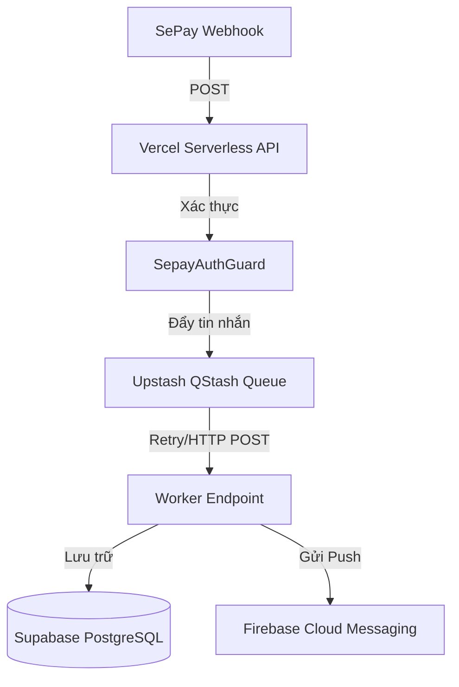

# SePay Proxy Backend - Tài Liệu Kỹ Thuật Toàn Diện (Production-Grade)

---

## 1. Tổng Quan Dự Án (Project Overview)

### Mục tiêu hệ thống
SePay Proxy Backend là giải pháp trung gian (Proxy) xử lý Webhook tài chính từ hệ thống SePay. Được thiết kế theo kiến trúc Serverless-first, hệ thống đảm bảo khả năng mở rộng không giới hạn, độ trễ thấp và chi phí vận hành tối ưu (0đ ở quy mô nhỏ).

### Luồng nghiệp vụ chính
1. **Tiếp nhận Webhook**: SePay gửi POST request chứa dữ liệu giao dịch.
2. **Xác thực**: Kiểm tra chữ ký (Signature) hoặc API Key đã mã hóa.
3. **Bất đồng bộ**: Đẩy dữ liệu vào Upstash QStash Queue để giải phóng kết nối ngay lập tức.
4. **Xử lý Worker**: QStash gọi lại Worker Endpoint để lưu Database (Supabase) và bắn Push qua Firebase (FCM).

---

## 2. Các Tính Năng Cốt Lõi (Core Features)

* **Multi-tenant Webhook Processing**: Phân tách dữ liệu tuyệt đối giữa các Tenant.
* **Idempotency Guarantee**: Cơ chế chống trùng lặp giao dịch (Advisory Locks).
* **Real-time Push Notifications**: Tích hợp FCM gửi tin nhắn tức thời.
* **Security Hardening**: Mã hóa AES-256-GCM cho thông tin nhạy cảm.
* **Observability**: Giám sát toàn diện qua Sentry và Axiom.

---

## 3. Công Nghệ Sử Dụng (Technology Stack)

| Thành phần | Công nghệ |
| :--- | :--- |
| **Framework** | NestJS (v11) |
| **Runtime** | Node.js (Serverless) |
| **Database** | Supabase PostgreSQL |
| **ORM** | Prisma (v7.8) + PrismaPg Adapter |
| **Queue** | Upstash QStash (HTTP-based) |
| **Push Service** | Firebase Cloud Messaging (FCM) |
| **Monitoring** | Sentry, Axiom |

---

## 4. Kiến Trúc Hệ Thống (System Architecture)

### Luồng dữ liệu (Data Flow)



---

## 5. Cấu Trúc Thư Mục (Project Structure)

```
├── api/                  # Entry point cho Vercel Serverless
├── prisma/               # Cấu hình Schema và Migrations
├── src/
│   ├── common/           # Guards, Filters, Middlewares dùng chung
│   ├── logger/           # Tích hợp Axiom Service
│   ├── notification/     # FCM Service
│   ├── prisma/           # Prisma Singleton Service
│   ├── queue/            # QStash Controller & Service
│   ├── webhook/          # Logic cốt lõi tiếp nhận Webhook
│   ├── app.module.ts     # Root Module (Config validation)
│   ├── instrument.ts     # Khởi tạo Sentry sớm nhất
│   └── main.ts           # Entry point cho Local Dev
```

---

## 6. Cấu Hình Môi Trường (Environment Configuration)

Hệ thống sử dụng file `.env` (không commit) và xác thực chặt chẽ qua `Joi` ngay khi khởi động.
Xem chi tiết tại [.env.example](file:///Users/builong/Develop/private/sepay-proxy-backend/.env.example).

---

## 7. Hướng Dẫn Cài Đặt Local (Local Development Setup)

1. **Cài đặt dependencies**:
   ```bash
   npm install
   ```
2. **Cấu hình file `.env`**: Sao chép từ `.env.example` và điền thông tin thực tế.
3. **Khởi động**:
   ```bash
   npm run start:dev
   ```

---

## 8. Quy Trình Làm Việc Với Database & Prisma

* **Prisma 7 Support**: Sử dụng `PrismaPg` adapter kết hợp Connection Pool.
* **Migration**:
  ```bash
  npx prisma migrate dev
  ```

---

## 9. Xử Lý Hàng Đợi & Sự Kiện (Queue)

* Sử dụng **Upstash QStash** để tránh nghẽn luồng.
* **Retry Strategy**: Tự động thử lại khi Worker Endpoint trả về mã lỗi >= 400.

---

## 10. Kiến Trúc Bảo Mật (Security)

* **Payload Validation**: Kiểm tra dữ liệu đầu vào qua DTO.
* **Data Encryption**: Mã hóa API Key người dùng trước khi lưu DB.

---

## 11. Giám Sát & Đo Lường (Observability)

* Log lỗi tự động đẩy lên Sentry.
* Log nghiệp vụ/audit đẩy về Axiom.

---

## 12. Hướng Dẫn Triển Khai (Deployment Guide)

Triển khai tự động qua GitHub Actions lên Vercel. Yêu cầu cấu hình đầy đủ Secrets trên GitHub Repo.

---

## 13. Chiến Lược Kiểm Thử (Testing Strategy)

* Chạy Unit Test: `npm run test`
* Chạy E2E Test: `npm run test:e2e`

---

## 14. Quy Trình Vận Hành (Operational Runbooks)

* **Xoay vòng Encryption Key**: Cần chạy script re-encrypt toàn bộ DB trước khi đổi key mới.

---

## 15. Xử Lý Sự Cố (Troubleshooting)

* Lỗi `EADDRINUSE`: Do tiến trình cũ chưa tắt, sử dụng `killall node` hoặc đổi cổng.

---

## 16. Khả Năng Mở Rộng (Scalability)

* Kiến trúc Stateless cho phép scale ngang không giới hạn trên Vercel Edge/Serverless.

---

## 17. Tiêu Chuẩn Đóng Góp (Contribution Standards)

* Tuân thủ ESLint và Prettier.
* Tạo Pull Request qua nhánh `dev` trước khi merge vào `main`.

---

## 18. Checklist Sẵn Sàng Cho Production

- [x] Cấu hình Pooling Database.
- [x] Bật Sentry & Axiom.
- [x] Mã hóa Secrets.

---

## 19. Bản Quyền

Dự án phát triển nội bộ.
